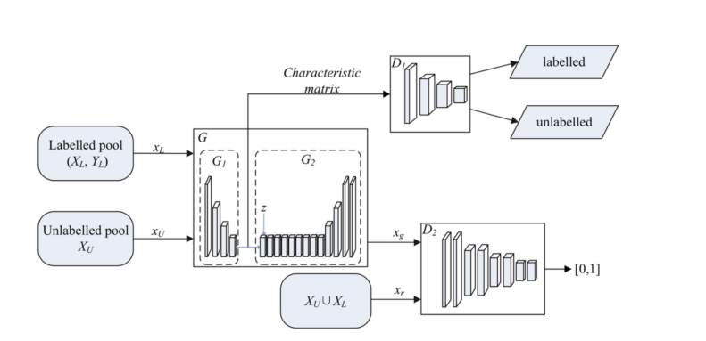

# DGAAL with Active Learning for Semi-Supervised Image Classification

This repository contains the implementation and iterative improvements of a **semi-supervised DGAAL framework** integrated with active learning strategies. Built as part of the Generative Deep Learning course project (CS 757, George Mason University), this work extends the "DGAAL: Unsupervised Dual Learning for Image-to-Image Translation" research paper.

## 📌 Project Highlights

- Developed a **dual-generator, dual-discriminator GAN architecture** for unsupervised image-to-image translation.
- Integrated a **semi-supervised classifier** for labeled sample predictions.
- Incorporated **active learning** strategies to reduce dependency on large labeled datasets.
- Evaluated performance on the **CIFAR-10** dataset.
- Implemented in PyTorch, with incremental improvements tracked across versions.

## 🔧 Architectural Overview

The architecture of **DGAAL (Dual-Generator Adversarial Active Learning)** consists of:

- Two Generators (GA and GB) for bidirectional image translation.
- Two Discriminators (DA and DB) for domain-specific realism.
- A shared classifier trained via an **active learning loop** using uncertainty sampling.
- Sampling strategies and improvements such as:
  - Adaptive sample selection
  - Progressive noise injection
  - Class-balanced data generation

## 🔍 Improvements Implemented

### ✅ First Improvement: Adaptive Sampling Strategy
- Introduced uncertainty-based **entropy scoring** to select the most informative unlabeled samples.
- Improved classification accuracy in early rounds of active learning with fewer labels.

### ✅ Second Improvement: Progressive Image Generation
- Injected **noise in the latent space** and progressively decayed it over epochs.
- Boosted image diversity and stabilized training convergence.

### ✅ Third Improvement: Class-Balanced Generation
- Applied a **stratified sample selection** mechanism to ensure balanced class representation during active learning rounds.
- Reduced class imbalance bias in classifier training.

## 📁 File Structure

- `dual.pdf` – Original research paper.
- `First_Improvement.py` – Implements the base DGAAL with adaptive sampling.
- `Second_Improvement.py` – Adds progressive noise injection to the first version.
- `Dual_Final.py` – Final version with all three improvements.
- `Report.pdf` – Full technical report with architecture details, experiments, results, and visualizations.

## 🧪 Dataset

- **CIFAR-10**: Contains 60,000 32x32 color images in 10 classes, with 6,000 images per class.
- Used a **small labeled subset** and a larger unlabeled pool for semi-supervised training.

## 🧠 Key Concepts Covered

- **DGAAL training (GAB & GBA, DA & DB)**
- **Cycle consistency and adversarial loss**
- **Entropy-based sample selection**
- **Progressive noise scheduling**
- **Class rebalancing via stratified active querying**

## 📈 Results Summary

- Classification accuracy improved by over **8%** after 5 active learning rounds compared to a basic semi-supervised classifier.
- Generated image quality improved across versions (see report for visuals).
- Demonstrated reduced reliance on labeled data without sacrificing performance.

## 🚀 Future Work

- Generalize the framework to domain adaptation and multi-class tasks.
- Apply on higher-resolution datasets (e.g., STL-10, CelebA).
- Explore transfer learning for initializing classifiers.

## 📄 Reference

This project is based on the research paper:  
**[Dual Generative Adversarial Active Learning (DGAAL)](https://doi.org/10.1007/s10489-020-02121-4)**  
*Junjie Zhu, Taoran Yi, et al. Applied Intelligence, 2020.*

## 👨‍💻 Author

Rishi Chandan – [LinkedIn](https://www.linkedin.com/in/rishichandan/) | [GitHub](https://github.com/rishichandan)

---

**Note**: This implementation is intended for educational and research purposes. Refer to the original paper and our technical report for detailed methodology and experimental setup.
